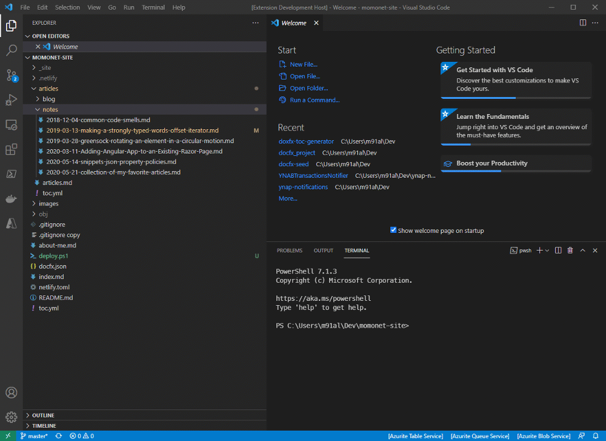

# DocFx Toc Generator for Visual Studio Code

Generate [DocFx](https://dotnet.github.io/docfx/index.html) Toc directly from VS Code. Simply right click on a folder and select "Generate YAML Toc".

# Work in Progress

- Support various sorting options. Currently, it's hardcoded to sort by file name in reverse.
- Toc for sub directories recursively.

## Requirements

The extension is only activated if there is a `docfx.json` file in the active workspace.

<!-- ## Extension Settings

Include if your extension adds any VS Code settings through the `contributes.configuration` extension point.

For example:

This extension contributes the following settings:

* `myExtension.enable`: enable/disable this extension
* `myExtension.thing`: set to `blah` to do something -->

## Known Issues

Calling out known issues can help limit users opening duplicate issues against your extension.

## Release Notes

### 0.0.1

* Initial release.

### 0.0.2

* Refactoring to support different sorting strategies.

-----------------------------------------------------------------------------------------------------------

## Following extension guidelines

Ensure that you've read through the extensions guidelines and follow the best practices for creating your extension.

* [Extension Guidelines](https://code.visualstudio.com/api/references/extension-guidelines)

